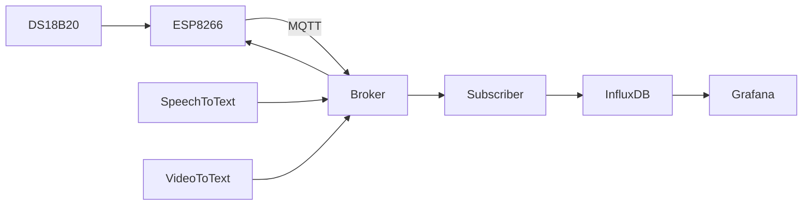

# IoT: ESP8266 with MQTT, Grafana, and Docker

## Project Overview

This IoT project integrates an ESP8266 microcontroller with a DS18B20 temperature sensor and uses MQTT for data communication. The temperature readings are visualized in Grafana, with the data stored in an InfluxDB database. The system also includes **speech-to-text** and **video-to-text** functionalities that communicate with the ESP8266 and display results on an LCD.

Key Features:
- Temperature measurement using DS18B20 and ESP8266.
- Data transmission to a remote MQTT broker with user authentication and encryption.
- Subscriber program writes data to InfluxDB and visualizes it in Grafana.
- Speech-to-text functionality using Whisper for converting spoken Polish to text and sending it via MQTT.
- Video-to-text functionality using YOLO for object detection and text transmission via MQTT.

## System Architecture



## Requirements

### Hardware:

1. `ESP8266`
2. `DS18B20 temperature sensor`
3. `LCD display`

### Software

1. `Python 3.10+`
2. `Docker & Docker Compose`
3. `MQTT Broker (e.g., emqx)`


## Installation Guide

### 1. `Clone the repository`

```bash
git clone https://github.com/kuben75/ESP8266.git
cd ESSSP8266
```

### 2. `Configure and flash the ESP8266 and start Arduino program`

1. `Upload the esp8266 program to your ESP8266 using the Arduino IDE.`
2. `Configure Wi-Fi credentials, MQTT broker address, username, and password in the code:`

```bash 
# Wi-Fi name and password
const char *ssid = "";           
const char *password = "";  
 #broker address                                    
const char *mqtt_broker = ""; 
# topic on MQTTX
const char *mqtt_topic_temp = "";                     
const char *mqtt_topic_speech = "";                  
const char *mqtt_topic_video = "";  
#MQTT username and password              
const char *mqtt_username = "";                               
const char *mqtt_password = ""; 
```
3. `Configure the python programs`
You need to configure the following Python scripts to match your setup:
`subscriber.py`
`speech-to-text.py`
`video-to-text.py`

Here is an example of the configuration required for MQTT in each script:
```bash
# MQTT broker address
mqtt_broker = ""
# MQTT topic for data transmission
mqtt_topic = ""
 # MQTT username for authentication
mqtt_username = "" 
 # MQTT password for authentication
mqtt_password = ""  
```
IMPORTANT NOTE`
 > ⚠️ The `subscriber.py` script also requires configuration for the InfluxDB client. Pay special attention to the following line of code 

```bash
#API token generated by influxdb, subscriber.py
influxdb_token = "YOUR_TOKEN"
 ```
This token is personal and must be generated in your InfluxDB instance. Follow these steps to generate the token:
1. Log in to your InfluxDB instance.
2. Navigate to Load Data -> API Tokens -> Generate API Token.
3. Select All Access API Token to generate a token with full permissions.
4. Copy the generated token and paste it into the influxdb_token variable in the `subscriber.py` script.

### 3. Set up Docker containers

```bash 

# If you are inside project, build the Docker containers
docker-compose build

# Start the containers
docker-compose up
```
Note: The first build might take 5–10 minutes, depending on your system and network speed. 

### 4. `Verify the setup`

1. `Access Grafana at http://localhost:3000.`
2. `Default Grafana credentials: admin / admin (please change them after login).`
3. `Use MQTT tools like MQTTX to test publishing and subscribing to the broker.`
## `Important Note` 
Grafana dashboards and InfluxDB configurations may require additional setup depending on your requirements. For example,  setting up InfluxDB as the data source in Grafana, you may encounter an error when using the default HTTP URL `http://localhost:8086`. This issue typically occurs when Grafana and InfluxDB are running on separate machines or containers.

To resolve this, replace `http://localhost:8086 `with the actual IP address of the machine running InfluxDB. For example:
```bash
http://192.168.1.104:8086
```

## Contributors
`Jakub Ławniczak`, `Grzegorz Rychlicki`